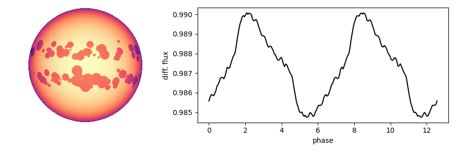
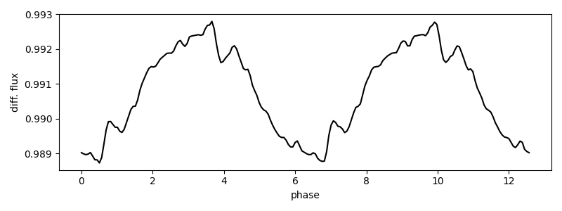

# spotter

<p align="center">
  Stellar contamination estimates from rotational light curves
  <br>
  <p align="center">
    <a href="https://github.com/lgrcia/spotter">
      
    </a>
    <a href="LICENCE">
      
    </a>
  </p>
</p>

*spotter* is a Python package to estimate transmission spectra stellar contamination from stellar rotational light curves.

## Example

```python
import numpy as np
from spotter import Star, butterfly

star = Star(u=[0.1, 0.2], N=128)

# spots properties
n = 100
theta, phi = butterfly(0.25, 0.08, n)
radii = np.random.uniform(0.01, 0.1, n)
contrast = 0.1

star.add_spot(theta, phi, radii, contrast)
star.plot()
```

<p align="center" style="margin-bottom:-50px">
    
</p>

```python
import matplotlib.pyplot as plt

phase = np.linspace(0, 4 * np.pi, 200)
flux = star.flux(phase)

plt.plot(phase, flux, c="k")
plt.xlabel("phase")
plt.ylabel("diff. flux")
```

<p align="center" style="margin-bottom:-50px">
    
</p>


